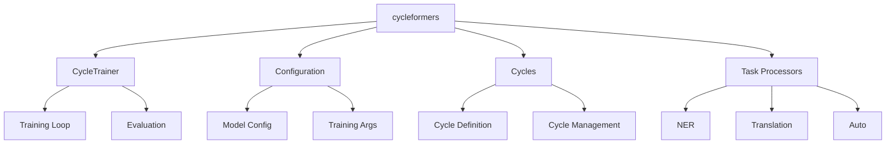

# API Reference

Welcome to the Cycleformers API Reference. This section provides detailed documentation for all public APIs, classes, and functions in the Cycleformers library.

## Overview

- [CycleTrainer](cycle_trainer.md): The main trainer class for cycle-consistency training
- [Configuration](configuration.md): Configuration classes and utilities
- [Cycles](cycles.md): Cycle definition and management
- [Task Processors](task_processors.md): Task-specific data processing and evaluation

## Module Structure

