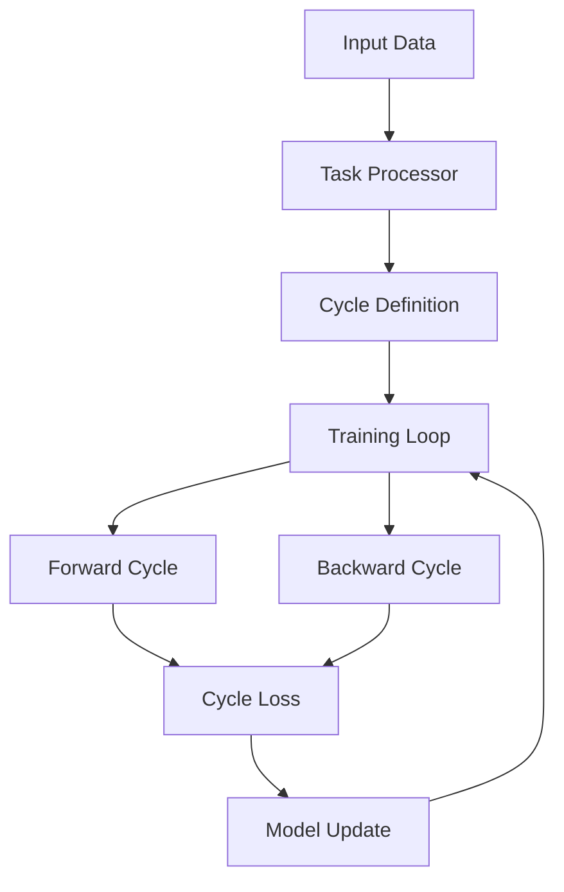

# Conceptual Reference

Welcome to the Cycleformers Conceptual Reference. This section provides in-depth explanations of the core concepts and methodologies used in Cycleformers.

## Core Concepts

### [Cycle-Consistency Training](cycle_consistency_training.md)
Understanding the fundamental principles of cycle-consistency training in NLP tasks.

### [MACCT](macct.md)
Deep dive into the Multi-Agent Cycle-Consistency Training methodology.

### [Task Processors](task_processors.md)
Learn about task-specific processing and how Cycleformers handles different NLP tasks.

### [Evaluation](evaluation.md)
Understanding how Cycleformers evaluates model performance and cycle-consistency.

## Architecture Overview

