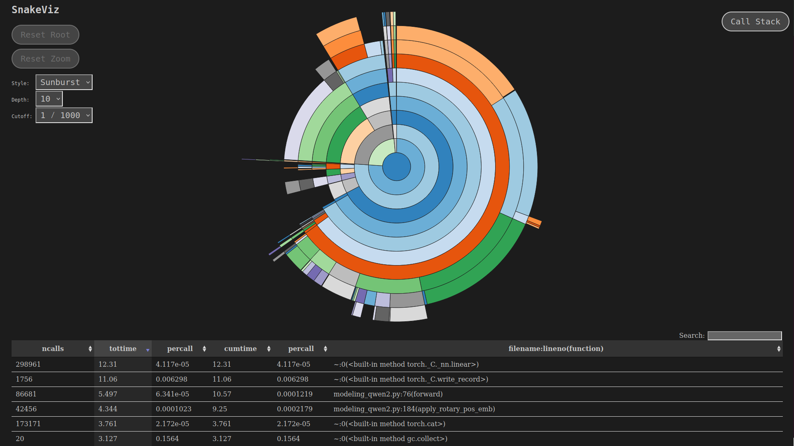
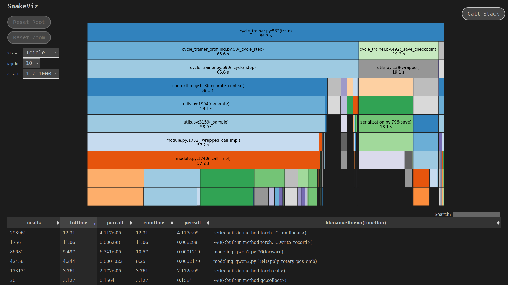

# Profiling Process

## Compute and Runtime Performance

1) Set up the appropriate config yaml in `profiler_configs/` and make any modifications to the script as needed.
2) Run the script as you would any of the examples e.g.
```bash
python cycle_trainer_profiling.py profiler_configs/causal.yaml
```

3) The script will generate a folder in `cycle_trainer_profiles/` with the start date and time of the run.
4) Snakeviz can be used to visualise the flame graph for the run:
```bash
# If working on remote machine
ssh -L 8080:localhost:8080 <username>@<remote_machine_ip>

# Run snakeviz
snakeviz cycle_trainer_profiles/<date_time_of_run>/profile.prof --server
>> flame graph can be viewed at http://localhost:8080/
```

### The Sunburst View

Read from the center outwards where each ring represents a level of function calls. The size (arc length) of each segment shows how much time that function took. The colors help distinguish different segments. Inner segments contain the functions that called them (outer segments).



### Icicle View

Each row represents a level in the call stack where the width of each bar represents the time taken by that function. Functions at the top call the functions below them. The full width represents 100% of the execution time.




## Memory Usage

Memory stats are recorded while computing the runtime stats. To view the CUDA memory snapshots, visit the [pytorch memory viz webpage](https://pytorch.org/memory_viz) and drag and drop in your `cuda_memory_snapshots.pickle` file.


### References
- [Understanding GPU Memory 1: Visualizing All Allocations over Time](https://pytorch.org/blog/understanding-gpu-memory-1/)
- [Understanding GPU Memory 2: Finding and Removing Reference Cycles](https://pytorch.org/blog/understanding-gpu-memory-2/)